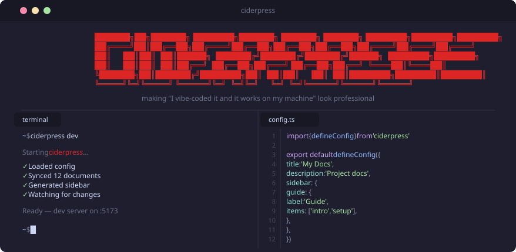

<div align="center">
  
  <p><strong>Press your docs.</strong></p>
  <p>A documentation framework for monorepos. Point it at your existing markdown — get a full site.</p>

<a href="https://github.com/thebytefarm/ciderpress/actions/workflows/ci.yml"></a>
<a href="https://www.npmjs.com/package/ciderpress"></a>
<a href="https://github.com/thebytefarm/ciderpress/blob/main/LICENSE"></a>

</div>

## Features

- **Your docs, your structure** — conforms to your repo, not the other way around.
- **One config, full chrome** — sidebars, nav, footer, edit links, version chip, announcement, and theme from one file.
- **Beautiful themes out of the box** — four built-in themes (`honeycrisp`, `grannysmith`, `midnight`, `arcade`) with full dark-mode support, plus first-class custom themes.
- **Monorepo-first** — built for internal docs with workspace cards, OpenAPI integration, and Liquid template support.

## Install

```bash
npm install ciderpress
```

## Usage

### Define your docs

```ts
// ciderpress.config.ts
import { defineConfig } from 'ciderpress'

export default defineConfig({
  title: 'my-project',
  description: 'Internal developer docs',
  sections: [
    {
      title: 'Getting Started',
      path: '/getting-started',
      include: 'docs/getting-started/*.md',
    },
    {
      title: 'Guides',
      path: '/guides',
      include: 'docs/guides/*.md',
      icon: 'pixelarticons:book-open',
      sort: 'alpha',
    },
  ],
  theme: { name: 'midnight' },
  site: {
    version: 'v1.0',
    edit: { repo: 'acme/docs', branch: 'main', directory: 'docs' },
    report: { repo: 'acme/docs' },
    topbarCta: { text: 'Get started →', href: '/getting-started' },
  },
})
```

### Run it

```bash
npx ciderpress dev       # start dev server with hot reload
npx ciderpress build     # build for production
npx ciderpress serve     # preview production build
```

## License

[MIT](LICENSE)
