# Architecture

High-level overview of how ciderpress is structured, its design philosophy, and how data flows through the system.

## Overview

ciderpress is a documentation framework for monorepos. It takes a single config file, syncs markdown content into a structured output directory, and builds a static site via [Rspress](https://rspress.dev). The information architecture -- sections, navigation, sidebar, landing pages -- is derived entirely from the config.

The codebase follows a functional, immutable, composition-first design. There are no classes, no `let`, no `throw` statements, and no loops. Errors are returned as `Result` tuples. Side effects (process exit, terminal output) are pushed to the outermost edges.

## Package Ecosystem

```tree
packages/
├── core/            # Sync engine, config loading, sidebar/nav generation
├── cli/             # CLI commands (dev, build, serve, check, diff, draft, clean, setup, dump)
├── ui/              # Rspress plugin, theme components, styles
├── config/          # @ciderpress/config — c12-based config loading, Zod validation
├── templates/       # @ciderpress/templates — Liquid template registry for draft command
├── theme/           # @ciderpress/theme — theme definitions and schema
└── ciderpress/          # ciderpress — public wrapper (re-exports core + ui + cli)
```

| Package                 | Purpose                                                                 |
| ----------------------- | ----------------------------------------------------------------------- |
| `@ciderpress/core`      | Config loading, entry resolution, sync engine, sidebar/nav gen          |
| `@ciderpress/cli`       | CLI commands: dev, build, serve, check, diff, draft, clean, setup, dump |
| `@ciderpress/ui`        | Rspress plugin, React theme components, CSS overrides                   |
| `@ciderpress/config`    | Config schema (Zod), type definitions, c12-based loading                |
| `@ciderpress/templates` | Liquid template registry for the `draft` command                        |
| `@ciderpress/theme`     | Theme definitions and schema                                            |
| `ciderpress`            | Public package: `.` and `./config` entry points + `ciderpress` CLI bin  |

### `ciderpress` (wrapper)

The public-facing package. Two entry points and a CLI bin:

| Entry      | Purpose                                   |
| ---------- | ----------------------------------------- |
| `.`        | Full API: core types + sync + UI + plugin |
| `./config` | Lightweight: just `defineConfig` + types  |

The `ciderpress` CLI bin is provided by this package and delegates to `@ciderpress/cli`. Users import `defineConfig` from `ciderpress` (or `ciderpress/config`) in their config file.

## Layers

```mermaid
%%{init: {
  'theme': 'base',
  'themeVariables': {
    'primaryColor': '#313244',
    'primaryTextColor': '#cdd6f4',
    'primaryBorderColor': '#6c7086',
    'lineColor': '#89b4fa',
    'secondaryColor': '#45475a',
    'tertiaryColor': '#1e1e2e',
    'background': '#1e1e2e',
    'mainBkg': '#313244',
    'clusterBkg': '#1e1e2e',
    'clusterBorder': '#45475a'
  },
  'flowchart': { 'curve': 'basis', 'padding': 15 }
}}%%
flowchart TB
    subgraph cli ["CLI Layer"]
        DEV(["dev"])
        BUILD(["build"])
        SERVE(["serve"])
        CHECK(["check"])
        DIFF(["diff"])
        DRAFT(["draft"])
        CLEAN(["clean"])
        SETUP(["setup"])
        DUMP(["dump"])
    end

    subgraph core ["Core Layer"]
        CONFIG(["config"])
        RESOLVE(["resolve"])
        COPY(["copy"])
        SIDEBAR(["sidebar"])
        NAV(["nav"])
        HOME(["home"])
        MANIFEST(["manifest"])
    end

    subgraph ui ["UI Layer"]
        PLUGIN(["plugin"])
        THEME(["theme"])
        RSPRESS_CFG(["rspress config"])
    end

    subgraph output [".ciderpress/"]
        CONTENT(["content/"])
        GENERATED([".generated/"])
        DIST(["dist/"])
    end

    DEV & BUILD --> CONFIG
    CONFIG --> RESOLVE --> COPY --> CONTENT
    RESOLVE --> SIDEBAR & NAV & HOME --> GENERATED
    RSPRESS_CFG --> GENERATED
    PLUGIN & THEME --> DIST

    classDef core fill:#313244,stroke:#89b4fa,stroke-width:2px,color:#cdd6f4
    classDef agent fill:#313244,stroke:#a6e3a1,stroke-width:2px,color:#cdd6f4
    classDef external fill:#313244,stroke:#f5c2e7,stroke-width:2px,color:#cdd6f4

    class DEV,BUILD,SERVE,CHECK,DIFF,DRAFT,CLEAN,SETUP,DUMP external
    class CONFIG,RESOLVE,COPY,SIDEBAR,NAV,HOME,MANIFEST core
    class PLUGIN,THEME,RSPRESS_CFG agent
    class CONTENT,GENERATED,DIST agent

    style cli fill:#181825,stroke:#f5c2e7,stroke-width:2px
    style core fill:#181825,stroke:#89b4fa,stroke-width:2px
    style ui fill:#181825,stroke:#a6e3a1,stroke-width:2px
    style output fill:#181825,stroke:#a6e3a1,stroke-width:2px
```



### CLI Layer

**Package:** `@ciderpress/cli`

The command-line interface. Uses [`@kidd-cli/core`](https://github.com/kidd-framework/kidd-cli) for command routing and `@kidd-cli/core/logger` for styled terminal output. Commands orchestrate the core sync engine and Rspress build APIs. See [CLI Reference](../references/cli.md) for command details.

### Core Layer

**Package:** `@ciderpress/core`

The sync engine and config system. See [Engine](./engine/overview.md) for pipeline details.

| Module                       | Purpose                                                   |
| ---------------------------- | --------------------------------------------------------- |
| `config.ts`                  | Config file discovery and loading via c12                 |
| `define-config.ts`           | Config validation at the boundary                         |
| `paths.ts`                   | Path constants for `.ciderpress/` output structure        |
| `sync/index.ts`              | Main sync pipeline orchestrator                           |
| `sync/errors.ts`             | SyncError and ConfigError definitions                     |
| `sync/types.ts`              | Sync-specific type definitions                            |
| `sync/copy.ts`               | Page writing with frontmatter injection and hash tracking |
| `sync/home.ts`               | Default home page generation                              |
| `sync/manifest.ts`           | Incremental sync tracking via content hashes              |
| `sync/openapi.ts`            | OpenAPI spec sync (dereference, MDX generation)           |
| `sync/images.ts`             | Image discovery, copy, and path rewriting                 |
| `sync/planning.ts`           | Planning page discovery from `.planning/` directory       |
| `sync/rewrite-links.ts`      | Relative link rewriting during copy                       |
| `sync/strip-xml.ts`          | XML tag stripping for planning documents                  |
| `sync/workspace.ts`          | Workspace item synthesis and card enrichment              |
| `sync/collect-workspaces.ts` | Workspace item collection from config                     |
| `sync/resolve/index.ts`      | Entry tree resolution (globs, text derivation, sorting)   |
| `sync/resolve/path.ts`       | Path resolution utilities                                 |
| `sync/resolve/recursive.ts`  | Recursive directory resolution                            |
| `sync/resolve/sort.ts`       | Entry sorting strategies                                  |
| `sync/resolve/text.ts`       | Text derivation from filename/heading/frontmatter         |
| `sync/sidebar/index.ts`      | Sidebar and nav JSON generation                           |
| `sync/sidebar/multi.ts`      | Multi-sidebar namespace building                          |
| `sync/sidebar/inject.ts`     | Virtual landing page generation (MDX)                     |
| `sync/sidebar/landing.ts`    | Landing page MDX generation                               |
| `banner/index.ts`            | SVG asset generation (banner, logo, icon)                 |

### UI Layer

**Package:** `@ciderpress/ui`

The Rspress theme and plugin:

| Module             | Purpose                                              |
| ------------------ | ---------------------------------------------------- |
| `plugin.ts`        | Rspress plugin: registers global UI components       |
| `config.ts`        | Rspress config factory: loads generated JSON, themes |
| `theme/index.tsx`  | Theme entry: re-exports Rspress base + custom styles |
| `theme/components` | React components: sidebar, home, workspace cards     |
| `theme/icons`      | Iconify icon mappings for tech tags                  |
| `theme/styles`     | CSS overrides for Rspress default theme              |

## Data Flow

```mermaid
%%{init: {
  'theme': 'base',
  'themeVariables': {
    'primaryColor': '#313244',
    'primaryTextColor': '#cdd6f4',
    'primaryBorderColor': '#6c7086',
    'lineColor': '#89b4fa',
    'secondaryColor': '#45475a',
    'tertiaryColor': '#1e1e2e',
    'actorBkg': '#313244',
    'actorBorder': '#89b4fa',
    'actorTextColor': '#cdd6f4',
    'signalColor': '#cdd6f4',
    'signalTextColor': '#cdd6f4'
  }
}}%%
sequenceDiagram
    participant User as ciderpress.config.ts
    participant CLI as CLI
    participant Sync as Sync Engine
    participant FS as .ciderpress/
    participant Rspress as Rspress

    rect rgb(49, 50, 68)
        Note over User,CLI: Load & Validate
        CLI->>User: Load config via c12
        User-->>CLI: Validated config
    end

    rect rgb(49, 50, 68)
        Note over CLI,FS: Sync
        CLI->>Sync: sync(config, paths)
        Sync->>Sync: Resolve entries (globs, text, frontmatter)
        Sync->>Sync: Generate sidebar + nav JSON
        Sync->>Sync: Inject landing pages (MDX)
        Sync->>FS: Write content/ + .generated/
    end

    rect rgb(49, 50, 68)
        Note over FS,Rspress: Build
        CLI->>Rspress: build() or dev()
        Rspress->>FS: Read content + sidebar + nav
        Rspress->>Rspress: Render with ciderpress theme
        Rspress-->>FS: Write dist/ (static site)
    end
```



## Error Handling

ciderpress uses the `Result<T, E>` tuple pattern for expected failures:

| Layer     | Strategy                      | Type                                  |
| --------- | ----------------------------- | ------------------------------------- |
| Core/sync | `Result<T, E>` tuples         | `[error, null]` or `[null, value]`    |
| Config    | Validate-and-exit at boundary | `process.exit(1)` with message        |
| CLI       | Catch and report              | `@kidd-cli/core/logger` error display |

## Design Decisions

1. **Config is the information architecture** -- A single file defines content structure, routing, navigation, and metadata. No separate sidebar/nav config files.
2. **Factories over classes** -- All components are factory functions returning plain objects.
3. **Result tuples over throw** -- Expected failures use `Result<T, E>`. No exceptions.
4. **Incremental sync** -- Mtime checks, content hashes, and config hashes skip unchanged work. Manifest comparison removes stale files.
5. **Virtual pages via MDX** -- Landing pages are generated at sync time as MDX with React components.
6. **Multi-sidebar from config** -- Isolated sections get independent sidebar namespaces automatically.
7. **Glob-driven content discovery** -- Patterns auto-discover files without manual entry per page.
8. **Frontmatter inheritance** -- Entries inherit frontmatter from ancestors in the config tree.

## References

- [Engine](./engine/overview.md)
- [Config](./config.md)
- [CLI Reference](../references/cli.md)
- [Coding Style](../standards/typescript/coding-style.md)
- [Design Patterns](../standards/typescript/design-patterns.md)
- [Errors](../standards/typescript/errors.md)
