# Dev Mode

The watch loop that powers `ciderpress dev` -- file watching, incremental resyncs, and Rspress hot reload.

## Overview

Dev mode combines three systems: an initial full sync, a file watcher that triggers incremental resyncs, and a Rspress dev server that picks up content changes via HMR. The watcher is the orchestrator -- it decides what kind of sync to run and whether to restart Rspress.

```mermaid
%%{init: {
  'theme': 'base',
  'themeVariables': {
    'primaryColor': '#313244',
    'primaryTextColor': '#cdd6f4',
    'primaryBorderColor': '#6c7086',
    'lineColor': '#89b4fa',
    'secondaryColor': '#45475a',
    'tertiaryColor': '#1e1e2e',
    'actorBkg': '#313244',
    'actorBorder': '#89b4fa',
    'actorTextColor': '#cdd6f4',
    'signalColor': '#cdd6f4',
    'signalTextColor': '#cdd6f4'
  }
}}%%
sequenceDiagram
    participant W as Watcher
    participant S as Sync Engine
    participant R as Rspress
    participant B as Browser

    rect rgb(49, 50, 68)
        Note over W,R: Markdown change
        W->>W: Debounce 150ms
        W->>S: Incremental sync
        S-->>W: Pages written/skipped
        Note over S,R: Rspress detects file changes
        R->>B: HMR update
    end

    rect rgb(49, 50, 68)
        Note over W,R: Config change
        W->>W: Debounce 150ms
        W->>W: Reload config + clear caches
        W->>S: Full sync
        S-->>W: Pages written
        W->>R: Restart dev server
        R->>B: Full reload
    end
```



## Lifecycle

```text
1. Parse args (@kidd-cli/core)
2. Resolve paths (.ciderpress/)
3. Load config (c12)
4. Clean (optional: remove cache/content/dist)
5. Create shared OpenAPI cache
6. Run initial sync (full)
7. Start Rspress dev server (:6174)
8. Create file watcher (fs.watch, recursive: true)
9. Enter watch loop
```

## File Watching

The watcher (`packages/cli/src/lib/watcher.ts`) uses Node.js native `fs.watch` with `recursive: true` -- a single FSEvents subscription on macOS, a single inotify recursive watch on Linux (Node 22+). It monitors the entire repo root and filters events in the callback.

**Ignored directories:** `node_modules`, `.git`, `.ciderpress`, `dist`, `.turbo`, `bundle`

### Trigger Table

| Event                                                | Trigger        | What happens                                                                               |
| ---------------------------------------------------- | -------------- | ------------------------------------------------------------------------------------------ |
| `.md`/`.mdx` change                                  | 150ms debounce | Incremental `sync()` -- unchanged pages skipped via mtime + content hash                   |
| `ciderpress.config.*` change, restart-relevant field | 150ms debounce | Reload config, full `sync()`, restart Rspress dev server (clears build cache)              |
| `ciderpress.config.*` change, non-restart-relevant   | 150ms debounce | Reload config, full `sync()`. Rspress is **not** restarted -- HMR picks up the new content |
| OpenAPI spec change (`.yaml`/`.json`)                | --             | Not watched -- restart `dev` or trigger a config change to re-parse                        |
| Non-markdown file change                             | --             | Ignored                                                                                    |
| Files in ignored dirs                                | --             | Dropped silently                                                                           |

## Concurrency

If a sync is already running, the next change queues a pending resync. Config reload state is tracked across queued syncs so a content change followed by a config change still triggers a full reload. After 5 consecutive sync failures, pending resyncs are dropped until the next file change.

## Rspress Restart

Config changes do not unconditionally restart Rspress. The watcher (`packages/cli/src/lib/watcher.ts:97-101`) only invokes `onConfigReload` when `needsServerRestart(previousConfig, config)` returns true — i.e. when the hash of restart-relevant fields differs between the old and new config. When triggered, the restart starts a fresh Rspress dev server with persistent build cache disabled so title/theme/color changes take effect. Content-only changes and edits to non-restart-relevant fields skip the restart; Rspress HMR picks up updated files directly from `.ciderpress/content/`.

### Restart-relevant fields

`needsServerRestart` (`packages/cli/src/lib/watcher.ts:223-260`) hashes exactly these top-level config fields:

```text
title, description, tagline, icon, theme, sidebar, socialLinks,
footer, home, openapi, actions, features, apps, packages, workspaces
```

A change to any of these triggers a server restart on the next sync. Changes to `sections`, `nav`, or any field not in this list reload + resync only.

When adding a new top-level config field, decide whether edits to it require a Rspress restart and update the hash list accordingly.

## OpenAPI Cache

A shared `Map<string, unknown>` is created once in the `dev` command and threaded through all sync passes. Dereferenced OpenAPI specs persist in the cache across resyncs, avoiding expensive re-parsing on content-only changes. The cache is cleared on config reload to force re-parsing.

## References

- [Engine Overview](./overview.md)
- [Pipeline](./pipeline.md)
- [Incremental Sync](./incremental.md)
- [OpenAPI Sync](./openapi.md)
- [CLI Reference](../../references/cli.md)
