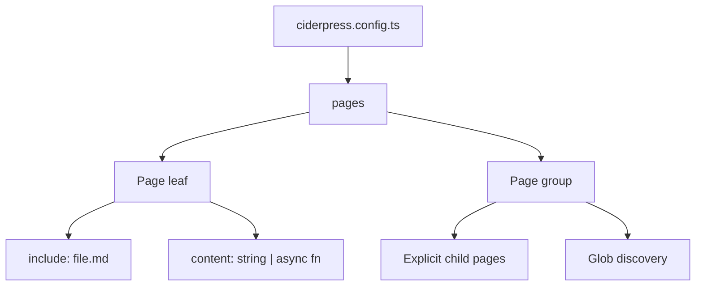

# Content

## Overview

Content in ciderpress is a tree of **pages** defined in the `pages` array of your config. `Page` is a single unified shape that describes every node in the tree — a leaf doc, a grouping node, or an auto-discovered section. Children come from explicit `pages`, a glob `include`, or an inline `content` source. Together they define your entire site structure without requiring you to restructure your existing files.



## The Page shape

Every node in the tree — top-level entry, child entry, auto-discovered file — is a `Page`. Fields are grouped by intent:

| Group        | Fields                                     | Purpose                                                             |
| ------------ | ------------------------------------------ | ------------------------------------------------------------------- |
| Identity     | `title`, `description`, `path`, `icon`     | What this page is and where it mounts                               |
| Source       | `include`, `content`, `pages`              | Where the markdown comes from (declare exactly one)                 |
| `nav.*`      | `hidden`, `collapsible`, `island`, `root`  | How the page behaves in the sidebar and topbar                      |
| `card`       | `CardConfig`                               | How this page renders as a card on a parent's landing page          |
| `defaults`   | `Frontmatter`                              | Frontmatter values merged into every child page (was `frontmatter`) |
| `discover.*` | `sort`, `recursive`, `ignore`, `indexFile` | Tuning for glob-discovered children                                 |
| `landing`    | `boolean`                                  | Whether to auto-generate a landing page at this `path`              |
| `openapi`    | `OpenAPISpec`                              | Per-page OpenAPI integration                                        |

A leaf page maps one markdown file to one URL. A group page has children (`pages` or a glob `include`) and gets an auto-generated landing page. There is no separate `Section` type — presentation differences are expressed through field combinations on the same `Page`.

## Leaf pages

A page maps a source markdown file to a URL.

```ts
{
  title: 'Architecture',
  path: '/architecture',
  include: 'docs/architecture.md',
}
```

Pages can use inline content instead of a file:

```ts
{
  title: 'Changelog',
  path: '/changelog',
  content: '# Changelog\n\nSee GitHub releases.',
}
```

Or generate content dynamically at build time:

```ts
{
  title: 'Status',
  path: '/status',
  content: async () => {
    const data = await fetchStatus()
    return `# Status\n\n${data}`
  },
}
```

Use async generators for changelogs pulled from an API, status pages with live data at build time, or generated documentation from schemas.

### Hidden pages

Set `nav.hidden: true` to build and route a page without showing it in the sidebar:

```ts
{
  title: 'Internal Notes',
  path: '/internal/notes',
  include: 'docs/internal/notes.md',
  nav: { hidden: true },
}
```

Hidden pages are still accessible by URL and can be linked to from other pages. Use this for redirect targets, utility pages, or pages linked from other content but not worth a sidebar entry.

## Group pages

A group page has children and renders as a collapsible heading in the sidebar.

### Explicit children

```ts
{
  title: 'Guides',
  pages: [
    { title: 'Quick Start', path: '/guides/quick-start', include: 'docs/guides/quick-start.md' },
    { title: 'Deployment', path: '/guides/deployment', include: 'docs/guides/deployment.md' },
  ],
}
```

### Auto-discovered children

Use a glob pattern with `path` to discover pages automatically:

```ts
{
  title: 'Guides',
  path: '/guides',
  include: 'docs/guides/*.md',
}
```

Every `.md` file matching the glob becomes a child page. The URL is derived as `path + "/" + filename-slug`. `path` is required with globs.

### Mixed

Combine explicit entries with auto-discovery. Explicit entries take precedence over glob matches with the same slug:

```ts
{
  title: 'Guides',
  path: '/guides',
  include: 'docs/guides/*.md',
  pages: [
    { title: 'Start Here', path: '/guides/start', include: 'docs/intro.md' },
  ],
}
```

## Nesting

Groups can nest arbitrarily. Groups deeper than level 1 are collapsible by default:

```ts
{
  title: 'API',
  pages: [
    {
      title: 'Authentication',
      pages: [
        { title: 'OAuth', path: '/api/auth/oauth', include: 'docs/api/auth/oauth.md' },
        { title: 'API Keys', path: '/api/auth/keys', include: 'docs/api/auth/keys.md' },
      ],
    },
  ],
}
```

### Recursive directories

For large doc trees that mirror a directory structure, use `discover.recursive: true`:

```ts
{
  title: 'Reference',
  path: '/reference',
  include: 'docs/reference/**/*.md',
  discover: {
    recursive: true,
    indexFile: 'overview',
  },
}
```

This maps directory nesting to sidebar nesting. In each directory, the `discover.indexFile` (default `"overview"`) becomes the section header page.

```text
docs/reference/
├── overview.md          → Section header for /reference
├── auth/
│   ├── overview.md      → Section header for /reference/auth
│   ├── oauth.md         → /reference/auth/oauth
│   └── api-keys.md      → /reference/auth/api-keys
└── database/
    ├── overview.md      → Section header for /reference/database
    └── migrations.md    → /reference/database/migrations
```

### Sidebar islands

By default all groups share one sidebar. Set `nav.island: true` to give a group its own sidebar namespace — children appear only when the user is inside that branch:

```ts
{
  title: 'API Reference',
  path: '/api/',
  nav: { island: true },
  pages: [
    { title: 'Auth', path: '/api/auth', include: 'docs/api/auth.md' },
    { title: 'Users', path: '/api/users', include: 'docs/api/users.md' },
  ],
}
```

When navigating to `/api/`, only that group's sidebar appears.

## Auto-Discovery

Glob patterns let you add pages without updating the config every time a new file is created. Discovery options live under `discover.*`.

### Title derivation

Control how page titles are derived from discovered files:

| Strategy        | Source                             | Example                                         |
| --------------- | ---------------------------------- | ----------------------------------------------- |
| `'auto'`        | Fallback chain (default)           | Frontmatter → heading → filename                |
| `'filename'`    | Filename converted to title        | `add-api-route.md` → "Add Api Route"            |
| `'heading'`     | First `# heading` in the file      | `# Adding an API Route` → "Adding an API Route" |
| `'frontmatter'` | `title` field in YAML front matter | `title: API Routes` → "API Routes"              |

Default is `'auto'`, which tries frontmatter first, falls back to heading, then filename.

```ts
{
  title: { from: 'frontmatter' },
  path: '/guides',
  include: 'docs/guides/*.md',
}
```

#### Custom transforms

Add a `transform` function for more control. The transform receives the derived title and the filename slug, returning the final display title.

```ts
{
  title: {
    from: 'auto',
    transform: (title, slug) => slug.replace(/^(\d+)-/, '$1. '),
  },
  path: '/adrs',
  include: 'docs/adrs/*.md',
}
```

Transforms only apply to auto-discovered children. Pages with explicit `title` strings are not transformed.

### Sorting

| Strategy      | Behavior                                                                                         |
| ------------- | ------------------------------------------------------------------------------------------------ |
| `'default'`   | Pins intro files (`introduction`, `intro`, `overview`, `index`, `readme`) to the top, then alpha |
| `'alpha'`     | Alphabetical by derived text                                                                     |
| `'filename'`  | Alphabetical by filename                                                                         |
| `'none'`      | Preserve glob-discovery order, no reordering                                                     |
| `(a, b) => n` | Custom comparator on `ResolvedPage`                                                              |

When `discover.sort` is omitted, the `'default'` strategy is used.

### Ignoring files

```ts
{
  title: 'Guides',
  path: '/guides',
  include: 'docs/guides/*.md',
  discover: {
    ignore: ['**/draft-*.md', '**/internal/**'],
  },
}
```

Global ignores in the top-level `discover.ignore` field apply to every page's auto-discovery.

### Deduplication

When combining explicit `pages` with `include`, explicit entries win. If an explicit entry has the same slug as a glob-discovered file, the glob match is dropped.

## Frontmatter and defaults

ciderpress treats `frontmatter` and `defaults` as two distinct concepts. Keeping them separate removes the ambiguity that comes from reusing one word for both.

- **`frontmatter`** — the literal YAML block at the top of a `.md` file. ciderpress reads it, merges defaults underneath it, and writes the result into the synced copy. Source files are never modified.
- **`Page.defaults`** — a config field that injects default frontmatter values into a page and its children. Same `Frontmatter` type, but the field is named after what it does rather than what it produces.

### Injecting defaults

Set `defaults` on any page to inject fields into the output page:

```ts
{
  title: 'Architecture',
  path: '/architecture',
  include: 'docs/architecture.md',
  defaults: {
    description: 'System architecture overview',
    aside: false,
  },
}
```

### Inheritance

`defaults` set on a group applies to all children:

```ts
{
  title: 'API Reference',
  defaults: { aside: 'left', editLink: false },
  pages: [
    { title: 'Auth', path: '/api/auth', include: 'docs/api/auth.md' },
    { title: 'Users', path: '/api/users', include: 'docs/api/users.md' },
  ],
}
```

Both `auth.md` and `users.md` inherit `aside: 'left'` and `editLink: false`.

### Merge order

Fields are merged with this precedence (highest wins):

1. Source file frontmatter (the literal YAML in the `.md` file)
2. Entry-level `defaults`
3. Inherited parent `defaults`

A page's own frontmatter always takes precedence over inherited defaults.

## Cards

Every page can carry a `card` block that controls how it appears on a parent's auto-generated landing page. Card config is independent of nav and source behavior, so the same `Page` can be a leaf doc with a custom card description and a custom icon:

```ts
{
  title: 'Authentication',
  path: '/api/auth',
  include: 'docs/api/auth.md',
  card: {
    description: 'OAuth, API keys, and session tokens',
    icon: 'pixelarticons:key',
  },
}
```

See [Navigation](/concepts/navigation) for landing-page rendering and card resolution rules.

## Design Decisions

- **One Page type for every node** — a leaf, a group, and an auto-discovered section all use the same shape. Different presentations come from field combinations (`include` vs `pages` vs glob; `card` vs `landing`; `nav.island` vs default), not different types.
- **`frontmatter` reserved for the YAML literal** — `defaults` is the config-side field that injects values, so "frontmatter" never has to mean two different things at once.
- **Grouped by intent** — `nav.*`, `discover.*`, `card`, and source-of-content live in their own buckets so each concern has one obvious home.
- **Config-driven, not filesystem-driven** — ciderpress maps your existing file layout into a sidebar tree via config rather than requiring a specific directory structure.
- **Globs over manual listing** — auto-discovery reduces config maintenance. New files appear in the sidebar automatically.
- **Frontmatter merge, not overwrite** — source files are never modified. ciderpress layers config-level defaults underneath at build time, keeping source of truth in the original markdown.
- **Explicit wins over discovered** — when combining `pages` with `include`, explicit entries take precedence, giving you an escape hatch for any file that needs special handling.

## References

- [Configuration reference — Page fields](/reference/configuration#page-fields) — complete field reference
- [Frontmatter Fields reference](/reference/frontmatter) — field types, defaults, and format details
- [Navigation](/concepts/navigation) — top nav bar and landing page generation
