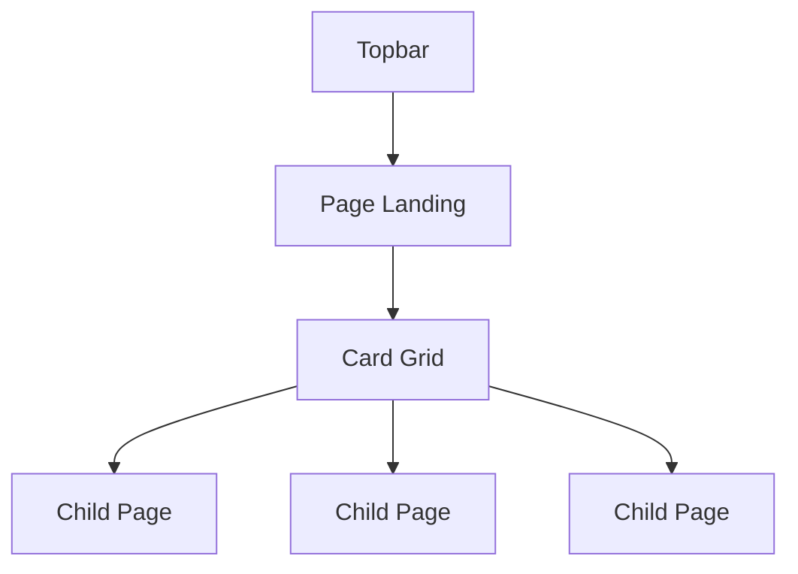

# Navigation

## Overview

Navigation in ciderpress is split across three surfaces: the **topbar** for top-level wayfinding, the **sidebar** for in-section navigation, and **landing pages** auto-generated for group pages with children. Topbar config lives under `topbar.*`, sidebar config lives under `sidebar.*`, and per-page sidebar behavior lives under `Page.nav.*`. Edit/report links and social links are top-level fields, matching the conventions of VitePress and Nextra.



## Topbar

The topbar is configured under the `topbar` object.

### Auto navigation

Set `topbar.nav: 'auto'` (the default) to derive topbar entries from your `pages` tree:

```ts
export default defineConfig({
  pages: [
    { title: 'Getting Started', path: '/getting-started', include: 'docs/getting-started.md' },
    { title: 'Guides', path: '/guides', include: 'docs/guides/*.md' },
    { title: 'Reference', path: '/reference', include: 'docs/reference/*.md' },
  ],
  topbar: { nav: 'auto' },
})
```

#### The auto-nav rule

> Auto-nav emits one top-level entry per root `pages` entry that has a `path`. Children are not flattened into dropdowns. Roots with `nav.hidden: true` are skipped. Workspaces declared via top-level `apps` / `packages` / `workspaces` are not included — they show on the home grid only. For dropdowns or workspace items in the topbar, use the explicit `NavItem[]` form.

### Explicit navigation

Pass an array of `NavItem` objects for full control:

```ts
topbar: {
  nav: [
    { title: 'Guides', link: '/guides/content' },
    { title: 'Reference', link: '/reference/configuration' },
  ],
}
```

### Dropdown menus

Nav items with `items` instead of `link` render as dropdown menus:

```ts
topbar: {
  nav: [
    {
      title: 'API',
      items: [
        { title: 'REST API', link: '/api/rest' },
        { title: 'GraphQL', link: '/api/graphql' },
      ],
    },
  ],
}
```

### Active state

In auto mode, nav items highlight based on the current URL matching the page's `path`. For explicit nav, use `activeMatch`:

```ts
{ title: 'API', link: '/api/overview', activeMatch: '/api/' }
```

The `activeMatch` value is a regex pattern tested against the current URL path.

### CTA, socials, and announcement

The topbar carries three optional companions:

| Field                 | Type                   | Purpose                                                                        |
| --------------------- | ---------------------- | ------------------------------------------------------------------------------ |
| `topbar.cta`          | `ButtonConfig`         | Primary call-to-action button on the right side of the topbar                  |
| `topbar.socials`      | `true \| SocialLink[]` | `true` reuses the top-level `socials` array; an array overrides for the topbar |
| `topbar.announcement` | `AnnouncementConfig`   | Thin announcement banner above the topbar                                      |

```ts
topbar: {
  nav: 'auto',
  cta: { text: 'Get Started', href: '/getting-started', variant: 'primary' },
  socials: true,
  announcement: {
    lead: 'NEW',
    message: 'v1.0 is here',
    cta: { label: 'Read the changelog', href: '/changelog' },
  },
}
```

`AnnouncementConfig` is `{ id?, lead?, message, cta?, persistent? }`. Setting `id` makes a dismissal persist in localStorage; `persistent: true` hides the dismiss button entirely.

## Sidebar

Sidebar chrome and per-page sidebar behavior are separated. The `sidebar.*` config controls persistent elements that flank the nav tree; `Page.nav.*` controls how an individual page behaves inside that tree.

### Persistent links

`sidebar.top` and `sidebar.bottom` are `ButtonConfig[]` — the same shape used by hero actions and the topbar CTA. Each entry carries `text`, `href`, and optional `variant` / `shape` / `icon`:

```ts
sidebar: {
  top: [
    { text: 'Home', href: '/', icon: 'pixelarticons:home' },
  ],
  bottom: [
    { text: 'GitHub', href: 'https://github.com/...', variant: 'ghost' },
  ],
}
```

`sidebar.top` renders above the nav tree; `sidebar.bottom` renders below.

### Promo block

`sidebar.promo` injects a promo card under the nav tree — useful for newsletter signups, community links, or product callouts. The shape is `{ title, body, cta: { text, href } }`:

```ts
sidebar: {
  promo: {
    title: 'Join the Discord',
    body: 'Chat with the team and other users.',
    cta: { text: 'Join now', href: 'https://discord.gg/...' },
  },
}
```

### Per-page nav behavior

The `Page.nav` block controls sidebar behavior for a single page:

| Field         | Type      | Behavior                                                                                                  |
| ------------- | --------- | --------------------------------------------------------------------------------------------------------- |
| `hidden`      | `boolean` | Hide this page (and its children) from the sidebar entirely. Still routable by URL.                       |
| `collapsible` | `boolean` | Show as a collapsible group. Defaults to `true`.                                                          |
| `island`      | `boolean` | Render as a sidebar island — children appear only when the user is inside this branch (was `standalone`). |
| `root`        | `boolean` | Mark as a sidebar root — only one root is active at a time; the topbar treats it as the active workspace. |

```ts
{
  title: 'API Reference',
  path: '/api/',
  nav: { island: true, root: true },
  pages: [...],
}
```

## Landing Pages

Group pages with children but no single-file `include` automatically get a generated landing page displaying cards that link to child entries.

### When landing pages generate

A landing page is created when a page has:

- A `path` field (defines the landing page URL)
- Child entries (via `pages` or a glob `include`)
- No `include` pointing to a single file (that would make it a regular page)

```ts
{
  title: 'Guides',
  path: '/guides',
  include: 'docs/guides/*.md',
}
```

Navigating to `/guides` shows a landing page with cards for each discovered guide.

### Disabling landing pages

The `landing` field controls whether the auto-generated landing page is created. It defaults to `true` for groups with children. Set `landing: false` to disable:

```ts
{
  title: 'Guides',
  path: '/guides',
  include: 'docs/guides/*.md',
  landing: false,
}
```

### Overview file promotion

When using `discover.recursive: true`, the `discover.indexFile` field controls which filename is promoted to the section header (default: `"overview"`). That file's content becomes the page's landing content instead of auto-generated cards.

```ts
{
  title: 'Reference',
  path: '/reference',
  include: 'docs/reference/**/*.md',
  discover: {
    recursive: true,
    indexFile: 'overview',
  },
}
```

### Page cards

Pages without workspace metadata display simple cards showing:

- Entry name (from `title`)
- Description (from child page frontmatter `description`)
- Icon colors that rotate automatically across cards

### Workspace cards

When workspace metadata (from `apps` / `packages` / `workspaces`) matches a page by `path`, the landing page uses workspace-style cards showing:

- Icon with color styling
- Scope label (e.g. `apps/`)
- Name and description
- Technology tag badges
- Optional deploy badge

See the [Workspaces](/concepts/workspaces) concept for workspace configuration.

### Controlling card content

Card descriptions are resolved in this order (highest priority first):

1. `card.description` on the page
2. `description` from the source file's frontmatter
3. The page's own `description` field on the config entry

```ts
{
  title: 'API Docs',
  path: '/api',
  include: 'docs/api/overview.md',
  card: {
    description: 'Complete API reference with examples',
    icon: 'pixelarticons:terminal',
  },
}
```

## Edit and Report Links

Edit-on-GitHub and report-an-issue links are top-level fields, matching the `editLink` convention used by VitePress and Nextra:

```ts
export default defineConfig({
  editLink: {
    repo: 'acme/docs',
    branch: 'main',
    directory: 'docs',
  },
  reportLink: {
    repo: 'acme/docs',
    label: 'File an issue',
  },
})
```

Setting either to `false` disables that link site-wide:

```ts
editLink: false,
reportLink: false,
```

Per-page overrides go through `Page.defaults` (e.g. `defaults: { editLink: false }` on a group hides the edit link for every child).

## Social Links

Social links are declared once at the top level under `socials`. They are the single source of truth — `topbar.socials` and `footer.socials` either reuse this array or override with their own:

```ts
export default defineConfig({
  socials: [
    { icon: 'github', url: 'https://github.com/acme/docs' },
    { icon: 'discord', url: 'https://discord.gg/acme', label: 'Community' },
  ],
  topbar: { socials: true },
  footer: { socials: true },
})
```

Each `SocialLink` is `{ icon, url, label? }`. `icon` accepts a known social-icon ID (`'github'`, `'discord'`, etc.) or `{ svg: string }` for a custom inline SVG.

## Design Decisions

- **Auto nav as default** — most sites want one topbar item per root page. Auto mode follows a single written rule (one entry per root page with a `path`) instead of magic flattening or workspace cross-pollination.
- **Workspaces stay on the home grid** — pulling workspaces into the topbar by default produced cluttered nav bars. Workspace topbar entries are now opt-in through the explicit `NavItem[]` form.
- **Landing pages over empty groups** — groups with children should never show a blank page. Auto-generated card grids give users an immediate overview of what's inside.
- **Workspace-aware cards** — when monorepo metadata exists, landing pages use richer cards with icons, tags, and badges rather than plain text links.
- **Industry-aligned top-level fields** — `editLink`, `reportLink`, and `socials` sit at the top level the way every modern docs framework does, instead of nesting under `site.*`.

## References

- [Configuration reference — NavItem](/reference/configuration#navitem)
- [Configuration reference — CardConfig](/reference/configuration#cardconfig)
- [Configuration reference — SocialLink](/reference/configuration#sociallink)
- [Workspaces](/concepts/workspaces) — monorepo workspace metadata
- [Content](/concepts/content) — page definitions and the `Page` shape
