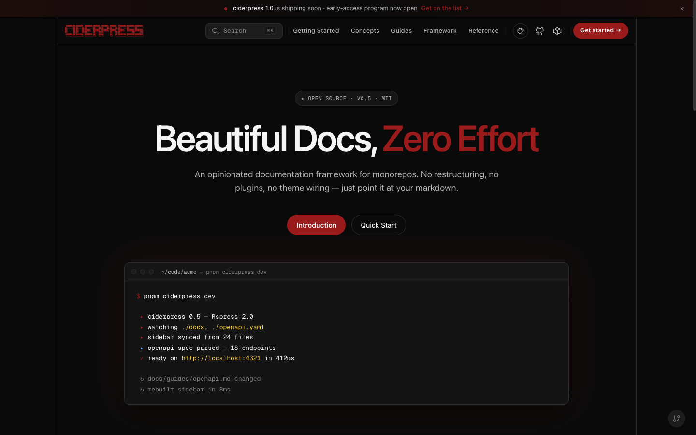
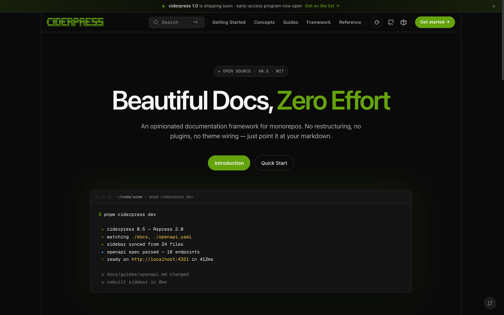
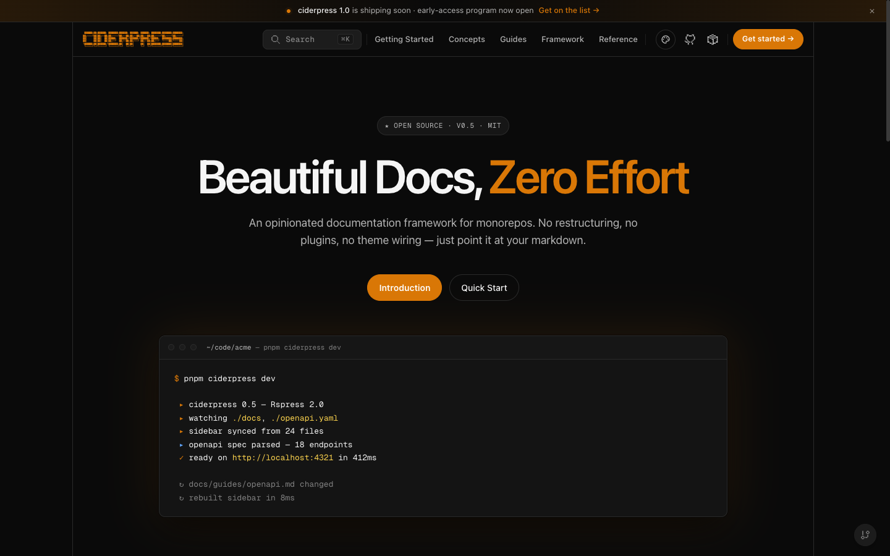

import { BrowserWindow, ThemeColorPalette } from '@theme'

# Themes

## Overview

A theme in ciderpress is a **brand identity** with one or more **variants**. Each variant is a complete set of design tokens that target either the `dark` or `light` aesthetic. ciderpress ships with six built-in themes — Mulled, Honeycrisp, Granny Smith, Amber, Midnight, and Arcade — and dark is the framework's baseline.

The `theme` block in your config registers which themes the site exposes, controls switcher visibility, and lets you override individual color tokens across every registered theme from one place.

| UI                | Job                                                                                                                            |
| ----------------- | ------------------------------------------------------------------------------------------------------------------------------ |
| ☀️ / 🌙 in nav    | Swap between variants _within_ the active theme. Hidden when `variantSwitcher: false` or the active theme has only one variant |
| 🎨 in site footer | Switch between _registered themes_. Hidden when `themeSwitcher: false` or only one theme is registered                         |

## Built-in Themes

### Mulled

The canonical brand. Deep cider burgundy — the "evening / premium" branch of the apple family. Primary `#991b1b` with both `dark` and `light` variants. The light variant pairs warm cream surfaces (`#fbf6f4`) with deep burgundy ink for a parchment read; the dark variant uses the same near-black canvas as the other apple themes. The legacy slug `'default'` is preserved as an alias and resolves to `'mulled'`.

**Variants:** `dark` (default) · `light`

<BrowserWindow url="https://docs.example.com">
  
</BrowserWindow>

<ThemeColorPalette theme="mulled" />

### Honeycrisp

Bright apple-red identity (primary `#dc2626`) with both `dark` and `light` variants — the sun/moon toggle is enabled.

**Variants:** `dark` (default) · `light`

<BrowserWindow url="https://docs.example.com">
  
</BrowserWindow>

<ThemeColorPalette theme="honeycrisp" />

### Granny Smith

Apple-green identity (primary `#65a30d`) with both `dark` and `light` variants — the sun/moon toggle is enabled.

**Variants:** `dark` (default) · `light`

<BrowserWindow url="https://docs.example.com">
  
</BrowserWindow>

<ThemeColorPalette theme="grannysmith" />

### Amber

Warm hearth amber identity (primary `#d97706`) with both `dark` and `light` variants. The light variant pairs parchment surfaces (`#fffaf2`) with deep-roast brown ink; the dark variant shares the apple-family near-black canvas.

**Variants:** `dark` (default) · `light`

<BrowserWindow url="https://docs.example.com">
  
</BrowserWindow>

<ThemeColorPalette theme="amber" />

### Midnight

Opinionated deep-black blue theme. Background sits at `#050505` for a near-pure-black surface. Single-variant (`dark` only) — the sun/moon toggle is hidden when this theme is active.

**Variants:** `dark`

<BrowserWindow url="https://docs.example.com">
  
</BrowserWindow>

<ThemeColorPalette theme="midnight" />

### Arcade

Retro neon-green theme inspired by arcade cabinets and CRT monitors. Single-variant (`dark` only). Includes custom hover animations: border tracing on cards, CRT scanlines on code blocks, neon pulse on buttons, glow effects on sidebar items.

**Variants:** `dark`

<BrowserWindow url="https://docs.example.com">
  
</BrowserWindow>

<ThemeColorPalette theme="arcade" />

## Configuration

The `theme` block in `ciderpress.config.ts` registers every theme the site can render and controls the switchers and cross-theme overrides:

```ts
import { defineConfig } from 'ciderpress'

export default defineConfig({
  title: 'My Docs',
  theme: {
    themes: ['mulled'],
  },
  pages: [
    /* ... */
  ],
})
```

### Fields

| Field             | Type                            | Default                         | Purpose                                                                                                            |
| ----------------- | ------------------------------- | ------------------------------- | ------------------------------------------------------------------------------------------------------------------ |
| `themes`          | `ThemeEntry[]` (required)       | —                               | Registry of every theme the site can switch between. First entry is the default unless one carries `default: true` |
| `defaultVariant`  | `'light' \| 'dark' \| 'system'` | `'dark'`                        | Initial variant to render on first paint                                                                           |
| `themeSwitcher`   | `boolean`                       | `true` when `themes.length > 1` | Show the named-theme picker                                                                                        |
| `variantSwitcher` | `boolean`                       | `true`                          | Show the light/dark toggle (auto-hidden when the active theme has only one variant)                                |
| `overrides`       | `Partial<ThemeColors>`          | —                               | Color tokens applied across **every** registered theme (see [Color Overrides](#color-overrides))                   |

### Theme entries

Each entry in `themes` is one of four forms:

1. **Built-in name** — `'mulled'`, `'honeycrisp'`, `'grannysmith'`, `'amber'`, `'midnight'`, or `'arcade'`.
2. **Built-in reference object** — `{ name: 'mulled', default: true }` (lets you mark a non-first entry as the default).
3. **Custom `defineTheme(...)` envelope** — `{ name, variants, defaultVariant? }` produced by [`defineTheme`](#custom-themes).
4. **Custom envelope with default marker** — any custom envelope plus `default: true`.

The first entry is treated as the site's default theme unless another entry carries `default: true`.

```ts
theme: {
  themes: [
    { name: 'honeycrisp' },
    { name: 'midnight', default: true },
    { name: 'arcade' },
  ],
}
```

### Forcing a starting variant

Each theme picks its own initial variant when there's no persisted preference. `defaultVariant` overrides this at the site level:

```ts
theme: {
  themes: ['honeycrisp'],
  defaultVariant: 'light',
}
```

`'system'` honors the user's OS-level light/dark preference. The user's last variant choice persists in `localStorage` and overrides this default on subsequent visits.

### Hiding the switchers

Set either switcher to `false` to suppress it from the UI:

```ts
theme: {
  themes: ['honeycrisp'],
  variantSwitcher: false,  // single-variant brand experience
}
```

`variantSwitcher` is automatically hidden when the active theme has only one variant (`midnight`, `arcade`) — CSS keys off `data-cp-variants` on `<html>`. `themeSwitcher` auto-hides when `themes` has a single entry.

## Color Overrides

Override individual color tokens across **every** registered theme without creating a new custom theme. Overrides apply as inline CSS custom properties and take precedence over each theme's variant defaults.

```ts
theme: {
  themes: ['honeycrisp', 'midnight'],
  overrides: {
    brand: '#ff6b6b',
    brandDark: '#cc5555',
  },
}
```

Use `overrides` for cross-theme brand consistency — e.g. forcing the same brand red on every theme so the site identity stays recognizable when users switch themes. For per-variant adjustments, prefer a [custom theme](#custom-themes) instead.

### Available color tokens

| Token        | Description                       |
| ------------ | --------------------------------- |
| `brand`      | Primary brand color               |
| `brandLight` | Lighter brand variant             |
| `brandDark`  | Darker brand variant              |
| `brandSoft`  | Soft/tinted brand for backgrounds |
| `bg`         | Main background                   |
| `bgAlt`      | Alternate background              |
| `bgElv`      | Elevated surface background       |
| `bgSoft`     | Soft background                   |
| `text1`      | Primary text                      |
| `text2`      | Secondary text                    |
| `text3`      | Tertiary/muted text               |
| `divider`    | Divider lines                     |
| `border`     | Border color                      |
| `homeBg`     | Home page background              |

Values must be valid CSS hex (`#xxx` or `#xxxxxx`) or `rgba()` values. The schema rejects CSS terminators (`;`, `{`, `}`, `</style>`) to defend against injection in tenant-supplied themes.

## Custom Themes

When the built-in themes plus overrides aren't enough, register a fully custom theme through `defineTheme` and pass it directly into `themes`:

```ts
import { defineConfig, defineTheme } from 'ciderpress'

const citrus = defineTheme({
  name: 'citrus',
  defaultVariant: 'dark',
  variants: {
    dark: {
      colors: {
        brand: {
          primary: '#ff7a3d',
          hover: '#ff8c54',
          active: '#e65f24',
          fg: '#2a0f06',
          soft: 'rgba(255, 122, 61, 0.14)',
          onBrand: '#2a0f06',
          light: '#ffa56a',
          lighter: '#ffc89a',
        },
        // ... see `CiderpressTokens` for the full token tree
      },
      // ... spacing, radii, fonts, shadows, motion, etc.
    },
    // Add a `light: { ... }` entry to enable the toggle for this theme.
  },
})

export default defineConfig({
  theme: {
    themes: [citrus],
  },
  // ...
})
```

The theme validates at config time and emits one `html[data-cp-theme='{name}'][data-cp-variant='{variant}']` CSS block per variant.

### Sharing tokens between variants

Token tree shapes are identical across variants. To share spacing/radii/fonts/etc. between `dark` and `light`, use object spread:

```ts
const shared = {
  spacing: { ... },
  radii:   { ... },
  fonts:   { ... },
}

defineTheme({
  name: 'citrus',
  variants: {
    dark:  { ...shared, colors: { /* dark palette */ } },
    light: { ...shared, colors: { /* light palette */ } },
  },
})
```

`defineTheme` validates each variant against the full token schema, so omitting a leaf surfaces a clear `ZodError` at config time.

### Constraints

| Constraint                     | Detail                                                                                                                                                                                                                                |
| ------------------------------ | ------------------------------------------------------------------------------------------------------------------------------------------------------------------------------------------------------------------------------------- |
| Theme `name` is a slug         | Must match `/^[a-z0-9][a-z0-9-]*$/`. Used directly in the `html[data-cp-theme='{name}']` selector.                                                                                                                                    |
| Reserved names rejected        | Custom themes cannot reuse a built-in slug (`mulled`, `honeycrisp`, `grannysmith`, `amber`, `midnight`, `arcade`) — those slugs are owned by `@ciderpress/theme`.                                                                     |
| At least one variant required  | `variants` must declare `dark`, `light`, or both. Empty `variants: {}` raises a `ZodError`.                                                                                                                                           |
| Token tree must be complete    | Every leaf in `CiderpressTokens` is required _per variant_. `defineTheme` validates each declared variant through `tokensSchema` and throws on missing leaves.                                                                        |
| Token values are CSS-safe      | Token strings reject `;`, `{`, `}`, and `</style>` to prevent CSS injection in tenant-supplied themes.                                                                                                                                |
| `defaultVariant` must exist    | When provided, the value must point at a declared `variants.*` entry.                                                                                                                                                                 |
| Persisted theme is validated   | When the theme switcher is enabled, the active theme is persisted in `localStorage`. On the next visit the value is intersected against the registry — stale entries are cleared and the user falls back to the build-time default.   |
| Persisted variant is validated | The active variant is persisted in `localStorage`. On the next visit it's intersected against the active theme's `variants` — when the user's theme no longer supports that variant, the theme's `defaultVariant` is applied instead. |

## Comparing Approaches

| Theme        | Best For                                | Variants    | Default variant |
| ------------ | --------------------------------------- | ----------- | --------------- |
| Mulled       | Premium / evening reads (canonical)     | dark, light | `dark`          |
| Honeycrisp   | Bright apple-red, general-purpose docs  | dark, light | `dark`          |
| Granny Smith | Green-branded, accessible docs          | dark, light | `dark`          |
| Amber        | Warm hearth / parchment cider aesthetic | dark, light | `dark`          |
| Midnight     | Developer tools, dark-first sites       | dark        | `dark`          |
| Arcade       | Playful branding, creative tools        | dark        | `dark`          |

## Design Decisions

- **Themes are brand identities; variants are dark/light.** This separation matches Chakra UI's `_dark`/`_light` and shadcn/ui's `.dark` selector — a theme is a brand, and dark/light is a property of the _site_.
- **Single `themes` array, single ordering rule.** First entry is default unless one is marked. There is no separate `name` field selecting from a global registry — what's in `themes` is what the site ships.
- **Separate switchers for theme vs. variant.** `themeSwitcher` and `variantSwitcher` answer different questions. Coupling them under one toggle made it impossible to ship a brand with only dark mode but still let the user pick between brand A and brand B.
- **Cross-theme `overrides`.** A site that ships three themes with a single shared brand red shouldn't have to re-declare it three times. One block, applied everywhere.
- **CSS custom properties.** Overrides are injected as inline CSS variables — debuggable in browser devtools and compatible with any CSS-in-JS approach.
- **Reduced motion support.** The Arcade theme's animations respect `prefers-reduced-motion`, disabling all continuous animations (border tracing, CRT scanlines, neon pulse, glow bar) automatically.

## References

- [Configuration reference — `theme`](/reference/configuration#theme) — full field reference
- [Configuration reference — `ThemeEntry`](/reference/configuration#themeentry) — the four entry forms
- `defineTheme` API — full input shape (see `packages/theme/src/index.ts`)
