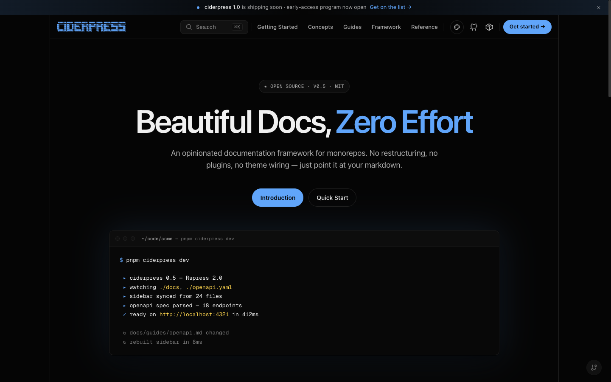
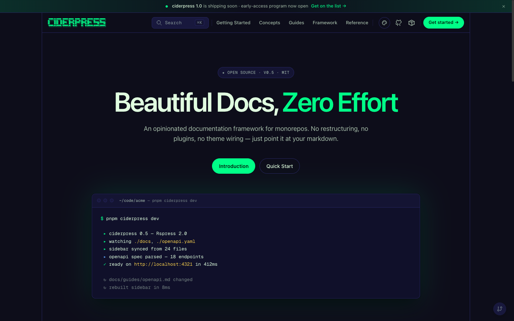

import { BrowserWindow } from '@theme'

# Themes

How the visual identity of your documentation site is controlled through built-in themes, per-theme variants, and color token overrides.

## Overview

A theme in ciderpress is a **brand identity** with one or more **variants**. Each variant is a complete set of design tokens that targets either the `dark` or `light` aesthetic. ciderpress ships with six built-in themes — Mulled, Honeycrisp, Granny Smith, Amber, Midnight, and Arcade — and dark is the framework's baseline (the initial paint is always dark unless the user explicitly toggles to light on a multi-variant theme).

| UI                | Job                                                                                                  |
| ----------------- | ---------------------------------------------------------------------------------------------------- |
| ☀️ / 🌙 in nav    | Swap between variants _within_ the active theme (hidden when the active theme has only one variant). |
| 🎨 in site footer | Switch between _registered themes_ (only rendered when `theme.switcher: true`).                      |

## Built-in Themes

### Mulled

The canonical brand. Deep cider burgundy — the "evening / premium" branch of the apple family. Primary `#991b1b` with both `dark` and `light` variants. The light variant pairs warm cream surfaces (`#fbf6f4`) with deep burgundy ink for a parchment read; the dark variant uses the same near-black canvas as the other apple themes. This is the default when `theme.name` is omitted. The legacy slug `'default'` is preserved as an alias and resolves to `'mulled'`, so existing `theme: { name: 'default' }` configs continue to render the canonical palette without churn.

**Variants:** `dark` (default) · `light`

<BrowserWindow url="https://docs.example.com">
  
</BrowserWindow>

### Honeycrisp

Bright apple-red identity (primary `#dc2626`) with both `dark` and `light` variants — the sun/moon toggle is enabled.

**Variants:** `dark` (default) · `light`

### Granny Smith

Apple-green identity (primary `#65a30d`) with both `dark` and `light` variants — the sun/moon toggle is enabled.

**Variants:** `dark` (default) · `light`

### Amber

Warm hearth amber identity (primary `#d97706`) with both `dark` and `light` variants. The light variant pairs parchment surfaces (`#fffaf2`) with deep-roast brown ink; the dark variant shares the apple-family near-black canvas.

**Variants:** `dark` (default) · `light`

### Midnight

Opinionated deep-black blue theme. Background sits at `#050505` for a near-pure-black surface. Single-variant (`dark` only) — the sun/moon toggle is hidden when this theme is active.

**Variants:** `dark`

<BrowserWindow url="https://docs.example.com">
  
</BrowserWindow>

### Arcade

Retro neon-green theme inspired by arcade cabinets and CRT monitors. Single-variant (`dark` only). Includes custom hover animations: border tracing on cards, CRT scanlines on code blocks, neon pulse on buttons, glow effects on sidebar items.

**Variants:** `dark`

<BrowserWindow url="https://docs.example.com">
  
</BrowserWindow>

## Configuration

Set the theme in your `ciderpress.config.ts`:

```ts
import { defineConfig } from 'ciderpress'

export default defineConfig({
  title: 'My Docs',
  theme: {
    name: 'arcade',
  },
  sections: [
    /* ... */
  ],
})
```

The `name` accepts any built-in theme (`mulled`, `honeycrisp`, `grannysmith`, `amber`, `midnight`, `arcade`) or any custom theme registered in the top-level `themes` array. The legacy slug `'default'` is preserved as an alias for `'mulled'`. An unknown name writes a build-time warning to stderr and falls back to `mulled`.

### Options

| Property     | Type                                                                             | Default         | Description                                                                                                |
| ------------ | -------------------------------------------------------------------------------- | --------------- | ---------------------------------------------------------------------------------------------------------- |
| `name`       | `'mulled' \| 'honeycrisp' \| 'grannysmith' \| 'amber' \| 'midnight' \| 'arcade'` | `'mulled'`      | Built-in or registered theme to use. `'default'` is accepted as an alias for `'mulled'`                    |
| `variant`    | `'dark' \| 'light'`                                                              | Theme's default | Force an initial variant. Must be present in the theme's `variants`; otherwise the theme's default is used |
| `switcher`   | `boolean`                                                                        | `false`         | Show the theme switcher dropdown in the site footer                                                        |
| `colors`     | `ThemeColors`                                                                    | —               | Color overrides applied to the `light` variant                                                             |
| `darkColors` | `ThemeColors`                                                                    | —               | Color overrides applied to the `dark` variant                                                              |

### Forcing a starting variant

Each theme picks its own initial variant when there's no persisted preference. You can override this from the config:

```ts
theme: {
  name: 'honeycrisp',
  variant: 'light',  // start in light mode on first visit
}
```

The user's last variant choice persists in `localStorage` and overrides this default on subsequent visits.

### Hiding the toggle

Themes with only one variant (`midnight`, `arcade`) automatically hide the ☀️/🌙 toggle. CSS keys off `data-cp-variants` on `<html>` — the provider sets it from the active theme's variant list. No config needed.

## Color Overrides

Override individual color tokens without creating a full custom theme. Overrides are applied as inline CSS custom properties and take precedence over the theme defaults.

```ts
theme: {
  name: 'midnight',
  colors: {
    brand: '#ff6b6b',
    brandDark: '#cc5555',
  },
  darkColors: {
    bg: '#000000',
  },
}
```

- `colors` applies to the **light** variant of the active theme.
- `darkColors` applies to the **dark** variant.

When the user toggles variants, the matching set kicks in.

### Available color tokens

| Token        | Description                       |
| ------------ | --------------------------------- |
| `brand`      | Primary brand color               |
| `brandLight` | Lighter brand variant             |
| `brandDark`  | Darker brand variant              |
| `brandSoft`  | Soft/tinted brand for backgrounds |
| `bg`         | Main background                   |
| `bgAlt`      | Alternate background              |
| `bgElv`      | Elevated surface background       |
| `bgSoft`     | Soft background                   |
| `text1`      | Primary text                      |
| `text2`      | Secondary text                    |
| `text3`      | Tertiary/muted text               |
| `divider`    | Divider lines                     |
| `border`     | Border color                      |
| `homeBg`     | Home page background              |

Color values must be valid CSS hex (`#xxx` or `#xxxxxx`) or `rgba()` values. The schema additionally rejects CSS terminators (`;`, `{`, `}`, `</style>`) to defend against injection in tenant-supplied themes.

## Custom Themes

When the built-in themes plus color overrides aren't enough, register a fully custom theme through `defineTheme`. The theme is validated at config time and emitted as one `html[data-cp-theme='{name}'][data-cp-variant='{variant}']` CSS block per variant.

```ts
import { defineConfig, defineTheme } from 'ciderpress'

const citrus = defineTheme({
  name: 'citrus',
  defaultVariant: 'dark',
  variants: {
    dark: {
      colors: {
        brand: {
          primary: '#ff7a3d',
          hover: '#ff8c54',
          active: '#e65f24',
          fg: '#2a0f06',
          soft: 'rgba(255, 122, 61, 0.14)',
          onBrand: '#2a0f06',
          light: '#ffa56a',
          lighter: '#ffc89a',
        },
        // ... see `CiderpressTokens` for the full token tree
      },
      // ... spacing, radii, fonts, shadows, motion, etc.
    },
    // Add a `light: { ... }` entry to enable the toggle for this theme.
  },
})

export default defineConfig({
  themes: [citrus],
  theme: { name: 'citrus' },
  // ...
})
```

### Sharing tokens between variants

Token tree shapes are identical across variants. To share spacing/radii/fonts/etc. between `dark` and `light`, use object spread:

```ts
const shared = {
  spacing: { ... },
  radii:   { ... },
  fonts:   { ... },
}

defineTheme({
  name: 'citrus',
  variants: {
    dark:  { ...shared, colors: { /* dark palette */ } },
    light: { ...shared, colors: { /* light palette */ } },
  },
})
```

`defineTheme` validates each variant against the full token schema, so omitting a leaf surfaces a clear `ZodError` at config time.

### Constraints

| Constraint                     | Detail                                                                                                                                                                                                                                                      |
| ------------------------------ | ----------------------------------------------------------------------------------------------------------------------------------------------------------------------------------------------------------------------------------------------------------- |
| Theme `name` is a slug         | Must match `/^[a-z0-9][a-z0-9-]*$/`. Used directly in the `html[data-cp-theme='{name}']` selector.                                                                                                                                                          |
| At least one variant required  | `variants` must declare `dark`, `light`, or both. Empty `variants: {}` raises a `ZodError`.                                                                                                                                                                 |
| Token tree must be complete    | Every leaf in `CiderpressTokens` is required _per variant_. `defineTheme` validates each declared variant through `tokensSchema` and throws on missing leaves.                                                                                              |
| Token values are CSS-safe      | Token strings reject `;`, `{`, `}`, and `</style>` to prevent CSS injection in tenant-supplied themes.                                                                                                                                                      |
| Persisted theme is validated   | When `switcher: true`, the active theme is persisted in `localStorage`. On the next visit the value is intersected against the registry — stale entries are cleared and the user falls back to the build-time default.                                      |
| Persisted variant is validated | The active variant is persisted in `localStorage['ciderpress-variant']`. On the next visit it's intersected against the active theme's `variants` — when the user's theme no longer supports that variant, the theme's `defaultVariant` is applied instead. |

## Comparing Approaches

| Theme        | Best For                                | Variants    | Default variant |
| ------------ | --------------------------------------- | ----------- | --------------- |
| Mulled       | Premium / evening reads (canonical)     | dark, light | `dark`          |
| Honeycrisp   | Bright apple-red, general-purpose docs  | dark, light | `dark`          |
| Granny Smith | Green-branded, accessible docs          | dark, light | `dark`          |
| Amber        | Warm hearth / parchment cider aesthetic | dark, light | `dark`          |
| Midnight     | Developer tools, dark-first sites       | dark        | `dark`          |
| Arcade       | Playful branding, creative tools        | dark        | `dark`          |

## Design Decisions

- **Themes are brand identities; variants are dark/light.** This separation matches Chakra UI's `_dark`/`_light` and shadcn/ui's `.dark` selector — a theme is a brand, and dark/light is a property of the _site_ (not the theme).
- **Dark is the framework baseline.** `defaultVariant: 'dark'` on every built-in. Light is a real first-class option, but you have to opt in.
- **Single-variant themes hide the toggle.** Midnight and Arcade are opinionated dark experiences — surfacing a light toggle would lie about what they ship.
- **CSS custom properties.** Overrides are injected as inline CSS variables, debuggable in browser devtools and compatible with any CSS-in-JS approach.
- **Reduced motion support.** The Arcade theme's animations respect `prefers-reduced-motion`, disabling all continuous animations (border tracing, CRT scanlines, neon pulse, glow bar) automatically.

## References

- [Configuration reference](/reference/configuration#top-level-fields) — `theme` field in the top-level config
- [`defineTheme` API](/reference/configuration#siteconfig) — full input shape
